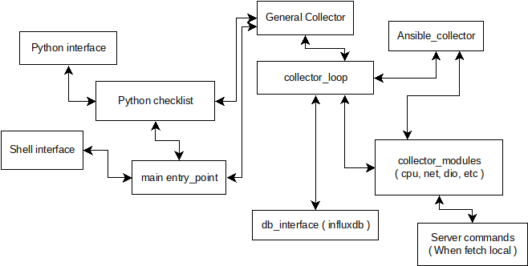

# Checklist
This is the repository for the AIX's Checklist tool

## Checklist ?!
The checklist started as a Korn Shell script to facilitate health-check assessments and performance evaluation of AIX Servers
As it evolved, some of it's contents were split into smaller scripts that could be integrated into 3rd party monitoring tools, like Splunk.
However as analysis became more complex and correlate behavior of several servers in parallel became more important, a major re-write in Python is being done.
At this moment moment about 10% of the original checklist have been ported to Python and it supports:
 - AIX servers 
 - PowerVM Virtual IO Servers
 - Oracle Databases ( using oracle_cx python module )

## Who should use it ? / Target Audience
This is intended to be used for data exploration, and server troubleshoot where combination of factors is crucial.<br>
While it's possible to do performance monitoring and even capacity planning using this tool, for that you should look for [njmon](https://www.ibm.com/support/pages/njmon-and-nmon-user-meetings)

## Python Script

The Python collector can run locally, within the server or use Ansible to fetch data from remote servers.<br>
All stats collected are parsed and sent to influxdb in order to allow for performance measurement over the time and health-check operations.<br>
All scripts are under [pq_checklist](pq_checklist/) directory, which works as a Python module.<br>
The entry point is pq_checklist.main, as described into the main.py file.<br>

### How to run it
You can run the checklist as a standard process through the "main.py" script or interactively from python shell

#### OS Shell ( Bash/KSH/etc )
In order to facilitate execution, a shell wrapper is provided

```shell
$ ./main.py -d
```

#####  Available parameters

| Parameter | Description |
| ---: | :--- |
| \-h | Help Message |
| \-l <file> | A influxdb dumpfile to load into the local database ( cannot be used along with -d ) |
| \-d | Run the checklist as a foreground daemon |
| \-c | Specify a config file to be used, skip search for a config file or create a new one |

#### Python shell
Within python3 shell it can be executed as a python module as shown bellow

```python
import pq_checklist
config,logger = pq_checklist.get_config(log_start=True,config_path='/etc/pq_checklist.conf')
collector_instance = pq_checklist.general_collector.collector(config=config,logger=logger)
collected_data = collector_instance.collect_all()
```

##### API Documentation
Most of the classes are properly commented out and python's using sphinx formatting<br>
This is a general overview of how the checklist components are tied together:


---

### Instalation
The Instalation and dependency tracking is being done using Python's setuptools.

  <pre>python3 setup.py install</pre>

#### Dependencies
At this moment the checklist ( regardless it's execution mode ), needs the following modules installed on the server:
  - ansible-runner
  - configparser
  - asyncio
  - influxdb_client
  - xdg

  If oracle will be monitored too, the cx_oracle python module is required<br>

  Normally all dependencies should be handled by setuptools during the install<br>
  for further information please check [setup.cfg](setup.cfg) file


#### Packaging and redistribution
Optionally you can package it into a bdist_whell or even a rpm package in order to facilitate distribution.<br>
Please check setuptools [documentation](https://packaging.python.org/en/latest/guides/distributing-packages-using-setuptools/#id67) for further details.

---

### Configuration
At first execution the checklist will look for it's configuration file following [XDG](https://specifications.freedesktop.org/basedir-spec/basedir-spec-latest.html) variables.<br>
If not found it will also look into **/etc** and **/opt/freeware/etc**, if not found there either it will create one at **\${XDG_CONFIG_HOME}**, using the [pq_checklist/pq_checklist.conf.template](pq_checklist/pq_checklist.conf.template) as template<br>
Key components of the configuration are organized as sessions, and those are:<br>

#### [INFLUXDB]
This session define the database connection parameters and also allow the checklist.<br>
If no database will be used, all query information will be dumped into *dump_file* destination<br>
It's advisable to not remove the parameter *url*.<br>
If no database will be used, just leave with default value "\<influxdb_url>\"<br>
Available tags:<br>

| Tag | Default | Description |
| :---: | :---: | :--- |
| url | \<influxdb_url\> | Url used to connect into influxDB |
| token | \<influxdb_token\> | InfluxDB authentication token |
| org | \<influxdb_org\> | Organization that will be used within InfluxDB |
| bucket | \<influxdb_bucket\> | Bucket into InfluxDB |
| timeout | 50000 | amount of seconds before consider that the query failed |
| dump_file | \/tmp\/influx_queries.json | File to store failed queries or any query if a invalid db url is provided |

#### [ANSIBLE]
When running on Ansible mode, this session define targets, which ansible playbook will be played, along with artifacts and modules location.<br>
It's advisable to not change the playbook or modules, unless you're extending the checklist capabilities.<br>
Available tags:<br>

| Tag | Default | Description |
| :---: | :---: | :--- |
|host_target | all | Host group which will be the target of the checklist |
|playbook | getperf.yml | Playbook that will be executed, right now the checklist look's for specifically defined into getperf.yml |
|private_data_dir | ansible | Base directory that holds ansible related assets |

#### [MODE]
Under this session its defined how the checklist will behave, which collectors are to be loaded and if the health check routines that exists within the collectors are to be called<br>
Available tags:<br>

| Tag | Default | Description |
| :---: | :---: | :--- |
| mode | local | If the checklist will get statistics from the **local** server or if it will use **ansible** to fetch data |
| healthcheck | True | If the healthcheck routine provided by the collector will be called upon its execution |
| collectors | \[ 'net', 'cpu', 'vio', 'dio' \] | Collectors to load with the checklist, please see collectors session for further details |

#### [LOOP]
This session define the interval, which the checklist will collect data
Available tags:<br>

| Tag | Default | Description |
| :---: | :---: | :--- |
| interval | 300 | Seconds between collection cycles ( only valid when using general_collector's loop ) |
| hc_loop_count | 2 | Interval in collection cycles to call Health routines, in this example hc will be performed every 600 seconds |

#### [CPU] && [ORACLE]
Those are sessions tied to collectors, please check the collector part of this document for details about these config sessions 

---

### Collectors
In order to simplify development, the checklist data gathering capabilities have been split into modules, which are called collectors.<br>
Each collector provide essentially two (02) things :
 - Measurements :<br>
   * Data to be inserted into InfluxDB for further analysis
 - Health Check :<br>
   * Automated analysis of the server health, based on the collected data

>**Important:**<br>
> Whatever message comes out from the health check functions just means something that should be checked from MY perspective.<br>
> Don't engage into tuning crusades or HW capacity endeavors without engage the proper support channels ( like your solution provider )

#### Health check
Each collector has it's own HealthCheck ( HC ) set of validations, and at each running cycle the HC messages consolidated through the collectors are pushed to syslog<br>
The messages follow the directives defined at the checklist configuration file

The Message report behavior follow a few patterns to minimize duplicity:

- Validate that the counter/metric has changed since previous reading whatever is possible
- Validate if it isn't something that normally changes
- If it changes normally, if it changing above normal rate ( right now just evaluate the average for the past 24 hours )

##### Message Location
All Healcheck messages go to syslog and use the script name as a main tag to messages:<br>
- **HC MGS FROM** Healthcheck from a specific server ( message details bellow )


---

#### net collector
This collector is responsible for parse network related commands<br>
On AIX and VirtualIO Servers, at this moment it will fetch the following commands:

- netstat -s
- netstat -aon
- entstat -d ( for each ent interface found on the server )


##### Health Check routines
At this moment this collector report warnings for several counters from [entstat](https://www.ibm.com/docs/en/aix/7.2?topic=e-entstat-command) command when the increment in abnormal ways, like:<br>

- a counter has not changed for the majority of it's life, but started to increase
- it changes frequently, but began to increase at a faster rate

In case the adapter is [etherchannel](https://www.ibm.com/docs/en/aix/7.2?topic=teaming-configuring-etherchannel) like adapter and is set to use LACP, it will also send messages in case LACP gets out of sync.

##### Counters currently monitored per adapter:

| Session from entstat | Counter |
| :---: | :--- |
| transmit_stats |  ( 'transmit_errors', 'receive_errors', 'transmit_packets_dropped', 'receive_packets_dropped', 'bad_packets', 's_w_transmit_queue_overflow', 'no_carrier_sense', 'crc_errors', 'dma_underrun', 'dma_overrun', 'lost_cts_errors', 'alignment_errors', 'max_collision_errors', 'no_resource_errors', 'late_collision_errors', 'receive_collision_errors', 'packet_too_short_errors', 'packet_too_long_errors', 'timeout_errors', 'packets_discarded_by_adapter', 'single_collision_count', 'multiple_collision_count' |
| 'general_stats' | ( 'no_mbuf_errors' ) |
| 'dev_stats' | ( 'number_of_xoff_packets_transmitted', 'number_of_xon_packets_transmitted', 'number_of_xoff_packets_received', 'number_of_xon_packets_received', 'transmit_q_no_buffers', 'transmit_q_dropped_packets', 'transmit_swq_dropped_packets', 'receive_q_no_buffers', 'receive_q_errors', 'receive_q_dropped_packets' ) |
| 'addon_stats' |  ( 'rx_error_bytes', 'rx_crc_errors', 'rx_align_errors', 'rx_discards', 'rx_mf_tag_discard', 'rx_brb_discard', 'rx_pause_frames', 'rx_phy_ip_err_discards', 'rx_csum_offload_errors', 'tx_error_bytes', 'tx_mac_errors', 'tx_carrier_errors', 'tx_single_collisions', 'tx_deferred', 'tx_excess_collisions', 'tx_late_collisions', 'tx_total_collisions', 'tx_pause_frames', 'unrecoverable_errors'  |
| 'veth_stats' | ('send_errors', 'invalid_vlan_id_packets', 'receiver_failures', 'platform_large_send_packets_dropped') |

##### Actions to perform due HC messages
For messages at *transmit_stats* session, this usually indicate issues on lower levels of the adapter, like :<br>

- physical switches errors
- physical adapter queue saturation ( usually something at *dev_stats* or *addon_stats* will come up too )
- virtual adapter saturation ( usually something at veth_stats will come up )

For messages under *dev_stats* and *addon_stats* this is usually tied to physical adapter saturation, like rx,tx queues, or buffer segmentation issues ( TSO/LSO )<br>
Normally counters at this session can be remediate through tuning on the number of queue sizes ( or even amount of queues ) and matching interrupt coalescing intervals with CPU resource.
Also, keep in mind that xoff/xon counters incrementing usually indicate CPU/bus starvation of either Server or switch side.

At this moment the checklist will report hints into troubleshoot issues for the following counters:<br>

| Session | Counter | Message | Impact, normal action | |
| :--- | :---: | :--- | :--- | :---: |
| veth_stats | send_errors | Error sending packages to VIOS, If buffers are maxedout please check VIOS resources | As long the servers are not running out of cores ( check cpu_collector ), normally adjust tiny/small/medium/large/huge buffers tend to address these issues | :yellow_circle: |
| veth_stats | receiver_failures | Error possible starvation errors at the server, If buffers are maxedout please check CPU capabilities | As long the servers are not running out of cores ( check cpu_collector ), normally adjust tiny/small/medium/large/huge buffers tend to address these issues | :yellow_circle: |
| veth_stats | platform_large_send_packets_dropped | Error sending PLSO packages to VIOS, If buffers are maxedout and no backend error at physical adapters, please check VIOS resources | As long the servers are not running out of cores ( check cpu_collector ), normally adjust the amount of dog_threads on AIX or sea_threads on VIOS help | :yellow_circle: |
| addon_stats | rx_pause_frames | Possible saturation at switch side | Nothing can be done at server side | :yellow_circle: |
| addon_stats | tx_pause_frames | Possible saturation at server side, Queues or CPU saturation is likely | As long the servers are not running out of cores ( check cpu_collector ), normally adjust intr_priority, intr_time might help under this issues | :yellow_circle: |
| dev_stats | number_of_xoff_packets_transmitted | Possible saturation at server side, Queues or CPU saturation is likely | As long the servers are not running out of cores ( check cpu_collector ), normally adjust intr_priority, intr_time might help under this issues | :yellow_circle: |
| dev_stats | number_of_xoff_packets_received | Possible saturation at server side, Queues or CPU saturation is likely | Nothing can be done at server side | :yellow_circle: |
| dev_stats | transmit_q_no_buffers | Buffer Saturation, possible more TX queues are advisable | As long the servers are not running out of cores ( check cpu_collector ), normally adjust *queue_size*, *tx_max_pkts*, *tx_limit* might help | :yellow_circle: |
| dev_stats | transmit_swq_dropped_packets | Buffer Saturation, possible bigger queues are advisable | Can lead to slowdowns| :yellow_circle: |
| dev_stats | receive_q_no_buffers | Buffer Saturation, possible more RX queues are advisable | Possible the combination of packages in all queues exceeded the amount of packages allowed in buffer, more queues might help in better management ( *queues_rx* increases ), otherwise increase the total amount of packages in buffer might help | :red_circle: |
| general_stats | no_mbuf_errors | Network stack lack of memory buffers, possible check of thewall is advisable | Possible innability of offload the packages from the adapter into AIX network stack, increase the network buffers ( at "no" command ), specially *thewall* might help| :yellow_circle: |
| lacp_port_stats | partner_state | LACP Error ( possible switch port mismatch ) | Can lead to loss of connectivity, check port-channel on both switches and server side | :red_circle: |
| lacp_port_stats | actor_state | LACP Error ( possible switch port mismatch ) | Can lead to loss of connectivity, check port-channel on both switches and server side  | :red_circle: |

For futher reading on the topic, please check:

- [https://community.ibm.com/community/user/power/blogs/jim-cunningham1/2020/06/22/aix-network-tuning-for-10ge-and-virtual-network](https://community.ibm.com/community/user/power/blogs/jim-cunningham1/2020/06/22/aix-network-tuning-for-10ge-and-virtual-network)
- [https://www.ibm.com/docs/en/aix/7.2?topic=parameters-network-option-tunable](https://www.ibm.com/docs/en/aix/7.2?topic=parameters-network-option-tunable)
- [https://www.ibm.com/support/pages/10-gbit-ethernet-bad-assumptions-and-best-practice](https://www.ibm.com/support/pages/10-gbit-ethernet-bad-assumptions-and-best-practice)
- [https://www.ibm.com/docs/en/ssw_aix_72/performance/performance_pdf.pdf](https://www.ibm.com/docs/en/ssw_aix_72/performance/performance_pdf.pdf)


##### Metrics inserted into InfluxDB
At this moment the net_collector provide the following metrics:

| metric | tag | Description |
| :--- | :---: | :--- |
| entstat | host | Server that originated the observation | 
| entstat | stats_type | Session within entstat command that generated the entry, can be : transmit_stats, general_stats, dev_stats, addon_stats, veth_stats |
| entstat | interface | Interface that generated the oservation |
| netstat_general | host |  Server that originated the observation |
| netstat_general | protocol | Protocol that generated the observation |
| netstat_general | session_group | Session within the protocol that generated information |
| netstat_general | session | Session within Session group that generated information |

#### cpu collector
This collector is responsible for CPU related commands<br>
On AIX it runs:<br>

- mpstat
- lparstat

##### Collector configuration
Follow the supported tags at the \[CPU\] session on the config file:

| Tag | Default | Description |
| :---: | :---: | :--- |
| samples | 2 | Readings from the commands used to calculate the usage |
| interval | 1 | Interval between the readings |
| rq_relative_100pct | 10 | Run Queue lenght to consider that the CPU is at 100% |
| max_usage_warn | 90 | Percentage of Utilization where the checklist trigger a high CPU usage warning |
| min_usage_warn | 30 | Percentage of Utilization where the checklist trigger a low CPU usage warning |
| min_core_pool_warn | 2 | Minimal amount of cores free on the shared processor pool before trigger a warning |
| other_warnings | True | If warnings related to ilcs and vlcs will be issues |
| involuntarycontextswitch_ratio | 30 | context switch ratio to consider that the server needs more CPUs to handle the workload |
| involuntarycorecontextswitch_ratio | 10 | core context switch ratio to consider that the server needs more CORES |

##### Health Check routines

The CPU collector will use data from mpstat and lparstat to evaluate if the server is running out of CPU resources if the CPU utilization goes beyond the threshold value defined into the config.<br>

- When the CPU is high, running on shared CPUs and the ilcs vs vlcs ratio is high too, it will trigger an alert suggesting to increase the Entitled Capacity of the LPAR
- When the CPU is high, running on shared CPUs and the cs vs ics ratio is high too, it will trigger an alert suggesting to increase the amount of VCPUs assigned to the LPAR
- When the Run Queue is high for the amount of CPUs on the server, if will trigger an alert suggesting to add more VCPUs or Cores to the LPAR ( threshold defined on config )
- If the LPAR is running on a specific shared processor pool, it reaches its limits, it will trigger an alert
- If the server is idle, it will trigger an alert suggesting to remove resources

##### Actions to perform due HC messages

| Message | Description | |
| :--- | :--- | :---:  |
| High CPU utilization detected along with possible core starvation of the lpar, due high ilcs vs vlcs ratio, values... | This message appear when the application is demanding more cores than it's promptly available to the server, core allocation above entitlement suffers from latency spikes and priority calculations | :yellow_circle: |
| High CPU utilization detected along with possible cpu starvation of the lpar, due high cs vs ics ratio, values... | This message appear when there aren't enought VCPUs on the server for the amount of running applications, this will lead to spikes in run queue, which might lead to server crashes | :orange_circle: |
| High CPU utilization detected, values... | High CPU detected and apprently the server has enough resources, this might be a problem and investigation is required | :red_circle: |
| LOW CPU utilization detected, values... | The server has more resources than it actually needs, CPU/Core removal could benefit the whole system | :green_circle: |
| High run queue detected on the server, value... | Normaly this happends when the process start to acomulate on the server, when this reach normally 10 x amount of VCPUs the server crash | :red_circle: |
| Shared processor pool near its capacity limit, value... | This indicate that the server is running inside a shared processor pool that is at it's limit, which will starve the lpars, more cores on the pool are needed | :orange_circle: |


  The actions on this case are kind of self explanatory

##### Metrics inserted into InfluxDB

| metric | tag | Description |
| :--- | :---: | :--- |
| mpstat | host | Server that generated the entry |
| lparstat | host | Server that generated the entry |


#### vio collector 

This collector works only on PowerVM VirtualIO Servers and wraps around parsing the following commands:<br>

- ioscli
  - seastat
- vnicstat

##### Health Check routines

At this moment all HC related messages are related to vnicstat, and it will trigger alerts when the following counters increase per adapter or per adapter's CRQ:<br>

- 'low_memory'
- 'error_indications'
- 'device_driver_problem'
- 'adapter_problem'
- 'command_response_errors'
- 'reboots'
- 'client_completions_error'
- 'vf_completions_error'

##### Actions to perform due HC messages

VNIC implements the [SRIO-V](https://en.wikipedia.org/wiki/Single-root_input/output_virtualization) specification to allow near direct access to the physical adapter.<br>
This means that data transfer to the adapter queues can be done directly by the Client LPAR, so the behavior would be nearly the same of a physical adapter.<br>
The glue that hold these queues together between at the Client LPAR is the Logical Port ( Slot ), which also define the behavior of the SRIO-V\'s Virtual Function. These defitions can be identified at the VIOS as the vnicserver\* adapters and the ent\* at the AIX LPARs.<br>
Errors ( like crc/send/recv/duplicate packages ) originated at physical level are simply passed to the client lpar using VF.<br>
When dealing with VNIC errrors, queue descriptors errors usually mean that all physical device queues got full for a moment,while VF errors could be tied to CPU/Memory starvation at Client or VIOS level.<br>
Assuming that no physical error have been observed at the adapter or switch itself... and CPU/Memory resources are available, a queue tunning could help.<br>
To evaluate queue sizes, it's good to consider that VNIC began on P8 servers, I think the default were something like this:
- A maximum of 02 queues per VNIC
- About 512 packages per Queue 

This was supposed to handle at least the same amount of packages handled by SEA.<br>
On P9 I've seen 04 and 06 queues per adapter, but as far I known, the limitations are on the NIC and bus itself, so this should increase fairly simply in the future. But keep in mind that increased capabilities won't mean that the defaults will increase too.<br>
Also more and bigger queues don't mean higher package throughput, as CPU still needed to lift the data from the adapter into the server memory, therefore device specific tuning might be required.

Also, keep in mind when the adapter is being shared across multiple VNICs the queues are shared too, therefore other clients can fill up the queues.

With that said, VNIC troubleshoot isn't very straightforward, so once the queues have been tweaked, if the issues continue... it's advisable to open a PMR with IBM to investigate further.

##### Metrics inserted into InfluxDB

| metric | tag | Description |
| :--- | :---: | :--- |
| vnicstat | host | Server that generated the entry |
| vnicstat | backing_device_name | Device at the VIOS |
| vnicstat | client_partition_id | LPAR ID of the AIX/Linux/i Client |
| vnicstat | client_partition_name | Hostname of the client lpar ( sometimes it comes empty when the client is linux ) |
| vnicstat | client_operating_system | Client Operating System |
| vnicstat | client_device_name | Device name at the client ( sometimes linux comes up with weird names ) |
| vnicstat | client_device_location_code | Slot at the Client partition |
| vnicstat | adapter | Adapter at VIOS |
| vnicstat | crq | CRQ number within the adapter |
| vnicstat | direction | rx/tx within the CRQ, within the adapter |
| seastat_vlan | host | Server that generated the entry |
| seastat_vlan | adapter | Adapter at VIOS |
| seastat_vlan | vlan | Vlan which the traffic is using |
| seastat_mac | host | Server that generated the entry |
| seastat_mac | adapter | Adapter at VIOS |
| seastat_mac | mac | Mac ( virtual HW ) address generating traffic |

> Regarding SEA:<br>
> Sea statistics usually comes from entstat command, therefore SEA related statistics are under entstat metrics

#### dio collector
This collector handle disk and disk adapter related metrics.

On AIX it handles the following commands:

- iostat
- fcstat ( for all fcs adapters on the lpar )

##### Health Check routines
##### Actions to perform due HC messages
##### Metrics inserted into InfluxDB


| metric | tag | Description |
| :--- | :---: | :--- |
| iostat_disks | host | Server that generated the entry |
| iostat_disks | disk | Disk name |


#### oracle collector
I'll eventually document it

#### bos collector
This is a inner collector that gather information about the target server and feed into the collectors.<br>
If the checklist's python interface is being used, device tree, serial numbers, SMT modes can be found here<br>
The documentation of this collector comes only through python help() interface and sphinx<br>

---

## Legacy / Standalone shell scripts
The scripts at sh directory are intended to be used in conjunction with [Splunk](https://docs.splunk.com/Documentation/Splunk/8.2.3/SearchReference/Script) and are not really used by the python collector or ansible anymore
Follow the list of scripts and it's purpose:

| Script           | Description |
| :--- | :--- |
| checklist-aix.sh | do a data capture of the server |
| fcstat.sh | Collect Fibre interface statistics |
| netstat.sh | Collect Ethernet interface statistics |
| cpu.sh | Collect CPU/CORE statistics |
| powerha_check.sh | Do a PowerHA Automate health check |
| vmstat_i.sh | Virtual Memory interrupt related statistics |
| vmstat_s.sh | Virtual Memory system wide statistics |
| lspath.sh | Disk multipath health ( Rely on AIX MPIO ) |
| errpt_count.sh | Count amount of elements out of errpt |
| seastat.sh | Get Network Statistics from VIOS SEA Adapters |
| mount.sh | Check filesystem mount parameters for unsafe settings |

## TODO / IDEAS

- [ ] Better documentation ( Better adoption of sphinx into the APIs )
- [ ] Send messages to a webhook instead of syslog ( like M$ Teams or Slack )
- [ ] Collect data from Linux Servers 
- [ ] Gather statistics from netstat -aon ( AIX )
- [ ] Handle other ioscli commands
- [ ] Handle Memory related commands
- [ ] Handle process related commands
- [ ] Gather data from SAP jobs
- [ ] Enable HC using data inside DB, without fetching data from server ( Python mode only, probably is the next one )
- [ ] Provide HC messages through rest APIs ( Using Flask or Tornado )
- [ ] Review fcstat data model and HC messages related to it
- [ ] When providing data through REST, convert the lists in np.arrays in order to use ML to calculate trends and isolate behaviors using ML
